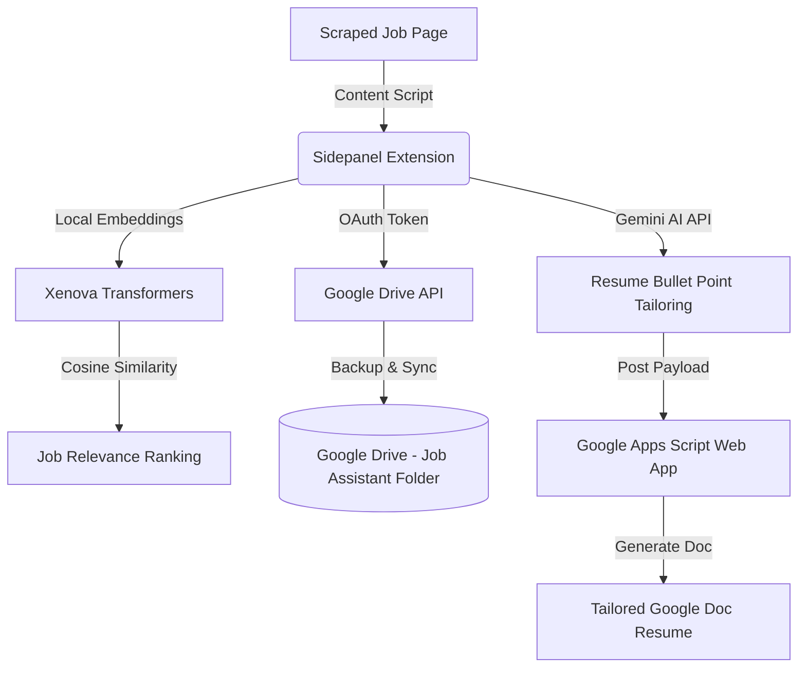

# Personal Jobs Assistant (Job Resume Tailoring)

An advanced Chrome Extension designed to automate job tracking, semantic resume/cover letter tailoring, and cloud synchronization utilizing local embeddings and Google Gemini API.

---

## 🚀 Features

- **🧠 Local AI Embedding Engine**: Utilizes `@xenova/transformers` with the `all-MiniLM-L6-v2` ONNX model directly in the browser's side panel to calculate cosine semantic similarity scores between your resume (Master Document) and scraped job postings.
- **✍️ AI-Powered Resume & Cover Letter Tailoring**: Leverages Google Gemini (`gemini-2.5-flash`) via the official `@google/generative-ai` library to critique your experience, generate optimized resume bullet points following the STAR method, and draft high-impact cover letters.
- **📁 Google Drive Cloud Sync**: Implements OAuth2 and Google Drive API integration to automatically sync job tracking metadata (`metadata.json`), store customized documents, and manage folders per company.
- **🛠️ Chrome Extension UI (Manifest V3)**: Styled clean and modular sidepanel dashboard using React and TypeScript.

---

## 🛠️ Tech Stack

- **Frontend/UI**: React 19, TypeScript 6, HTML5, Vanilla CSS
- **Bundler/Build Tool**: Webpack 5, TS Loader
- **AI/LLMs**: Google Generative AI (`gemini-2.5-flash`), Xenova Transformers (`all-MiniLM-L6-v2` local model execution)
- **APIs & Backend**: Google Drive API, Chrome extension API (Identity, Storage, SidePanel)

---

## 📋 Prerequisites

Before setting up the extension, make sure you have:
1. **Node.js** (v16+ recommended)
2. **Google Gemini API Key** (Get one from [Google AI Studio](https://aistudio.google.com/))
3. **Google Apps Script Web App** (Set up to receive tailored resume contents and generate Google Docs)
4. **Google Cloud OAuth Client ID** (Registered for a Chrome Extension to utilize `chrome.identity`)

---

## ⚙️ Installation & Setup

### 1. Clone the repository
```bash
git clone https://github.com/RPG-coder/job-resume-tailoring.git
cd job-resume-tailoring
```

### 2. Install dependencies
```bash
npm install
```

### 3. Configure environment variables
Create a `.env` file in the root directory by copying the example:
```bash
cp .env.example .env
```
Fill in the credentials in `.env`:
```env
REACT_APP_WEBAPPURL="https://script.google.com/macros/s/.../exec"
GOOGLE_API_KEY="your-gemini-api-key-here"

# Resume Personalization Variables
REACT_APP_RESUMENAME="Your Name"
REACT_APP_RESUMEADDRESS="City, State"
REACT_APP_RESUMEEMAIL="your.email@example.com"
REACT_APP_RESUMEPHONE="123-456-7890"
REACT_APP_RESUMELINKEDIN="https://linkedin.com/in/yourprofile"
REACT_APP_RESUMEGITHUB="https://github.com/yourusername"

# Education Defaults
REACT_APP_RESUMEMSEDUCATION="Master of Science in Computer Science"
REACT_APP_RESUMEMSEDUCATIONGPA="4.0"
REACT_APP_RESUMEMSEDUCATIONYEAR="Dec 2021"
REACT_APP_RESUMEBSEDUCATION="B.E in Information Science"
REACT_APP_RESUMEBSEDUCATIONUNIVERSITY="Your University Name"
REACT_APP_RESUMEBSEDUCATIONYEAR="Jul 2019"
```

### 4. Build the extension
Run Webpack to bundle the scripts and copy assets into the `/dist` directory:
```bash
# Build once
npm run build

# Watch for changes (for active development)
npm run watch
```

### 5. Load the extension in Chrome
1. Open Google Chrome and navigate to `chrome://extensions/`.
2. Enable **Developer mode** (toggle in the top-right corner).
3. Click **Load unpacked** (top-left).
4. Select the **`dist`** directory inside the project folder.
5. Pin the "Personal Jobs Assistant" extension, navigate to a job description, and open the extension sidepanel!

---

## 📂 Architecture Overview



---

## 📄 License

This project is licensed under the MIT License - see the [LICENSE](LICENSE) file for details.